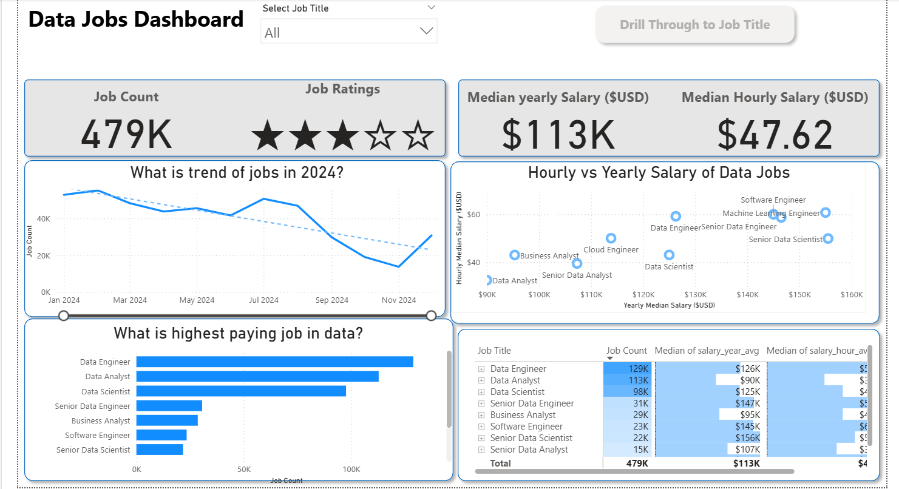
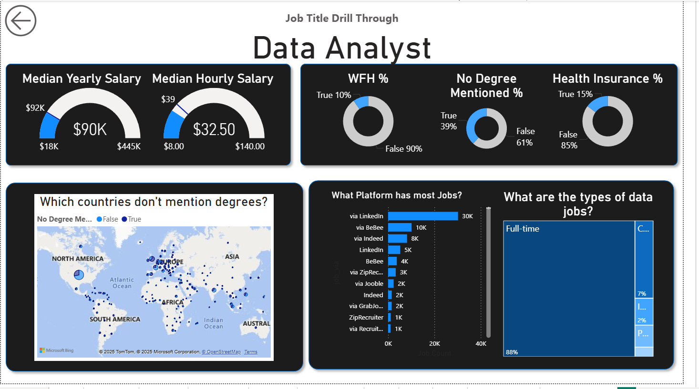
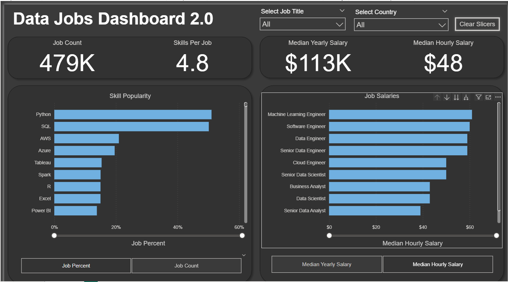

# Global Data Jobs Analytics Dashboard

A Power BI project that explores job postings for data-related roles around the world.  
It provides insights into:
-  Job Trends Over Time
-  Salary Comparisons
-  In-Demand Skills
-  Job Locations by Country
-  Drill-through for Each Job Title

---

##  Dashboards

| Version | Description | File |
|--------|-------------|------|
| v1.0 | Initial dashboard version with global view, filters and drill-through for wach job title | [Data_Jobs_Dashboard_1.0.pbix](./Data_Jobs_Dashboard_1.0.pbix) |
| v2.0 | Enhanced and concise version made for basic users in mind. Provides Job count and percentage for skills required in different Data jobs and their respective salaries | [Data_Jobs_Dashboard_2.0.pbix](./Data_Jobs_Dashboard_2.0.pbix) |

---

##  Key Features

-  Interactive filters and slicers
-  Drill-through functionality per job title
-  Country-wise job opportunity breakdown
-  Time-based trend analysis
-  Top skills per job role
-  Clean layout & intuitive UX

---

##  How to Use

1. Download any `.pbix` file above.
2. Open with **Power BI Desktop**.
3. Explore, filter, or modify as needed.

---

##  Screenshots

| DashBoard | Drill-through | DashBoard_Final |
|---------|----------------|------------------|
|  |  |  |

---

##  Author

**Geetansh Grover**  
[LinkedIn](linkedin.com/in/geetansh-grover-90a004252/)   
